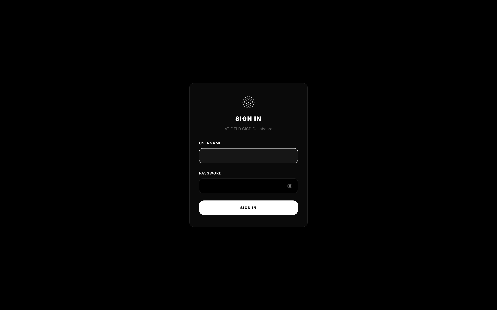

# AT FIELD CICD


CI/CD platform with a web dashboard. Builds, tests, and deploys with strong isolation and controlled pipelines - like an Absolute Terror Field for your projects

## Screenshots

| Login | Dashboard |
|-------|-----------|
|  |  |

| Repositories | Scripts |
|--------------|---------|
|  |  |

| Notifications | Logs |
|---------------|------|
|  |  |

| Audit | Settings |
|-------|----------|
|  |  |

| Users | Profile |
|-------|---------|
|  |  |

## Quick Start

```bash
cp .env.example .env          # set ADMIN_USER / ADMIN_PASSWORD
docker-compose up -d          # dashboard at http://localhost:3000
```

Point a repo webhook at `http://your-host:3000/webhook/<slug>`.

## How It Works

1. A push lands (webhook or poll catch-up).
2. Commit messages are scanned for keywords you defined per-repo.
3. Matching actions run one at a time through a serial queue, each with its own log.

**Actions:** `script` (run a `.sh`), `deploy` via `rsync`, or `deploy` via `ssh`.

## Security

- scrypt password hashing, HttpOnly `SameSite=Strict` session cookies
- Per-repo webhook signature verification (HMAC-SHA256 / token)
- RBAC: `admin` / `devops` / `developer`
- `spawn()` with array args - no shell injection; path-traversal guards everywhere
- HTTP headers: `nosniff`, `DENY` framing, `no-store`, `no-referrer`

See [SECURITY.md](SECURITY.md) for the full model and hardening checklist.

## Development

```bash
npm install
npm start                                  # node server.js
python3 scripts/screenshot-dashboard.py    # regenerate screenshots
bash test-smoke.sh                          # smoke tests
```

## License

[MIT](LICENSE) - © 2026 danial

## AI Assistance

Parts of this project were developed with assistance from DeepSeek.
