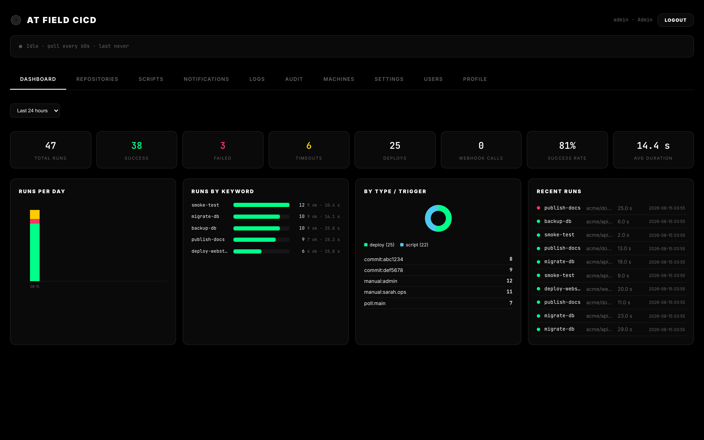
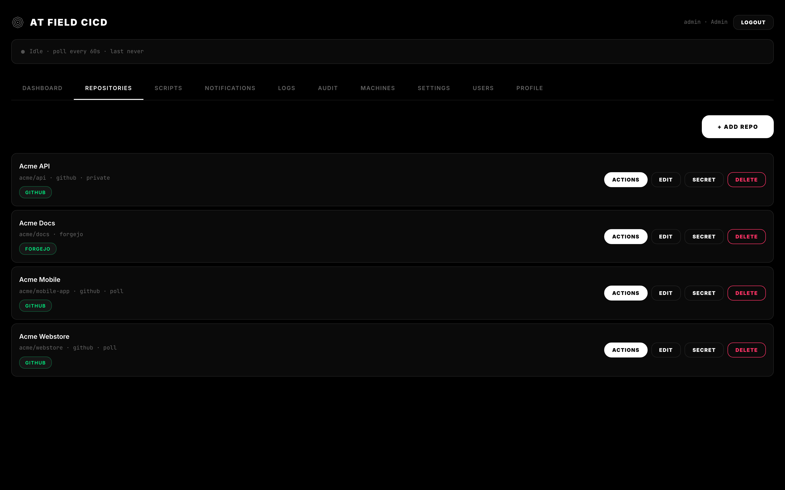
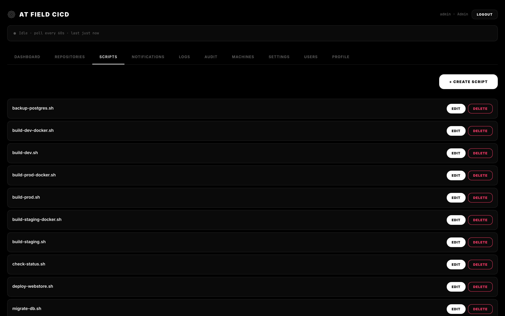
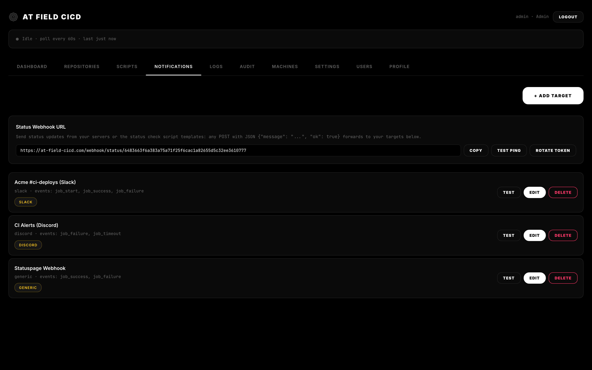
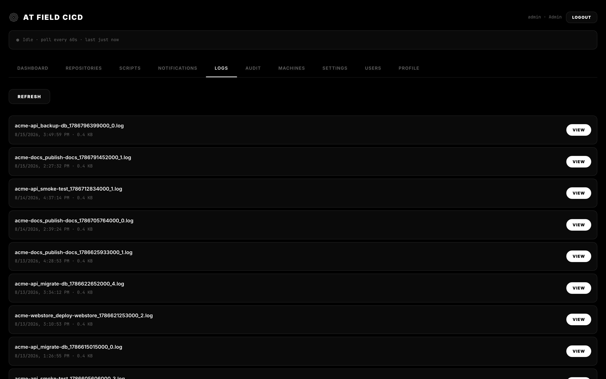
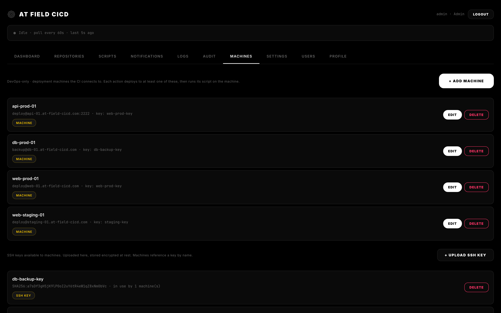
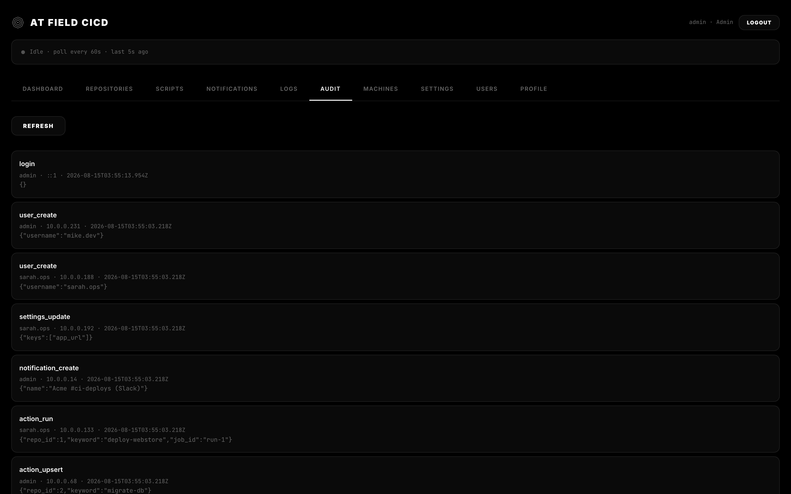
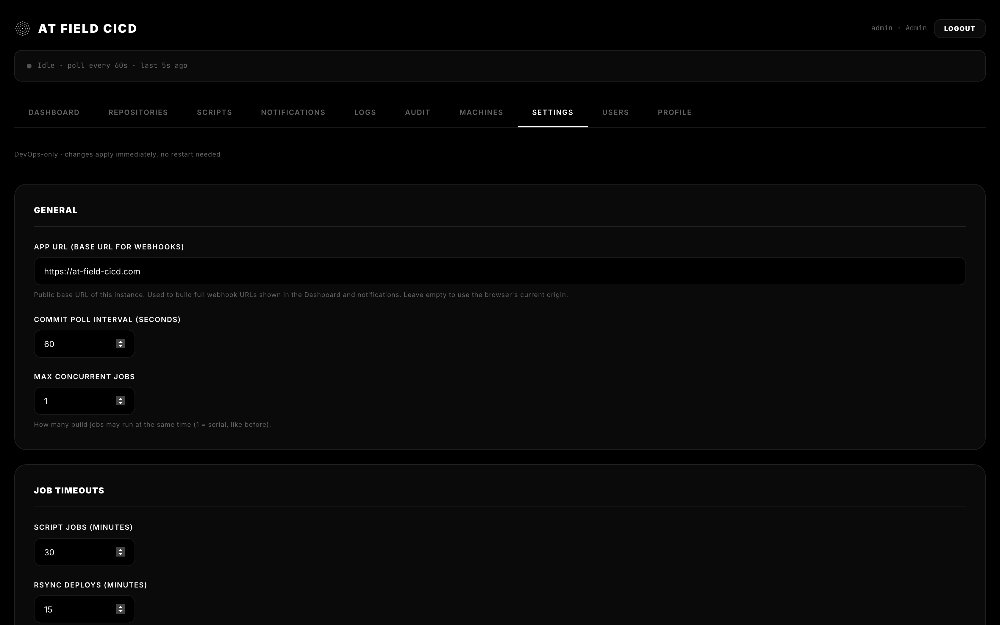
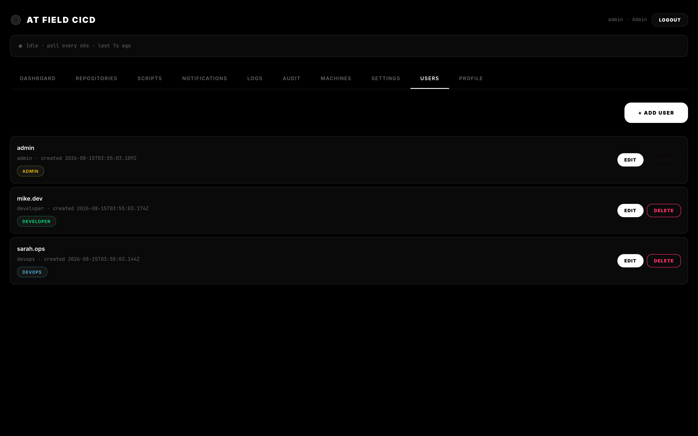
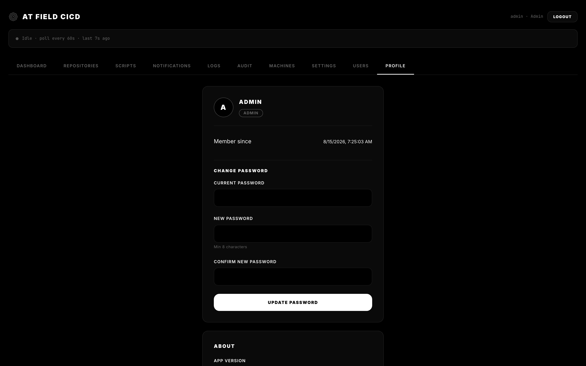

# AT FIELD CICD


CI/CD platform with a web dashboard. Builds, tests, and deploys with strong isolation and controlled pipelines — like an Absolute Terror Field for your projects.

**Features:** keyword-triggered pipelines from commit messages (webhook or commit polling) · deploy to one or many machines (rsync/SSH) and run scripts on them · encrypted SSH keys at rest · RBAC (admin / devops / developer) · notifications (webhook, Discord, Slack, Telegram, Pushover, Gotify, ntfy) · full audit trail · offline-capable single Node.js process with SQLite.

## Screenshots

<table>
  <tr>
    <td align="center"><b>Dashboard View</b><br></td>
    <td align="center"><b>Repositories</b><br></td>
  </tr>
  <tr>
    <td align="center"><b>Script Manager</b><br></td>
    <td align="center"><b>Notifications</b><br></td>
  </tr>
  <tr>
    <td align="center"><b>Build Logs</b><br></td>
    <td align="center"><b>Machines</b><br></td>
  </tr>
  <tr>
    <td align="center"><b>Audit Trail</b><br></td>
    <td align="center"><b>Settings Page</b><br></td>
  </tr>
  <tr>
    <td align="center"><b>Users &amp; Roles</b><br></td>
    <td align="center"><b>Profile Page</b><br></td>
  </tr>
</table>

## Quick Start

```bash
cp .env.example .env          # set ADMIN_USER / ADMIN_PASSWORD
docker-compose up -d          # dashboard at http://localhost:3000
```

Point a repo webhook at `http://your-host:3000/webhook/<slug>` — or enable
**commit polling** per repo and skip webhooks entirely.

Requires Node.js ≥ 20 (or the bundled Docker image).

## Demo Data

`scripts/seed-demo.js` wipes the DB and `logs/`, then seeds production-looking
demo data so every tab has something to show:

```bash
node scripts/seed-demo.js     # users: admin, sarah.ops, mike.dev (password demo1234)
node server.js                # sign in as admin / demo1234
```

## How It Works

1. A push lands (webhook or poll catch-up).
2. Commit messages are scanned for keywords you defined per-repo.
3. Matching actions run one at a time through a serial queue, each with its own log.

**Actions:** every action pairs a deploy step with a script. Devops/admin register **deployment machines** (SSH target + port + key) in the *Machines* tab; each action picks at least one machine, a deploy method (`rsync` or `ssh`), and a script. The job connects to each machine, deploys, then runs the script on the machine itself. SSH keys are uploaded in the Machines tab and stored encrypted at rest in the DB.

**Notifications:** targets (webhooks, Discord, Slack, Telegram, Pushover, Gotify, ntfy, generic Shoutrrr-style URLs) are created in the *Notifications* tab, subscribed to job events, and may carry a custom message template. Actions can additionally select which of your targets get a completion notification (with an optional per-action template) — see the action editor's *Notifications* section.

## Security

- scrypt password hashing, HttpOnly `SameSite=Strict` session cookies
- Per-repo webhook signature verification (HMAC-SHA256 / token)
- RBAC: `admin` / `devops` / `developer`
- SSH keys encrypted at rest (AES-256-GCM, master key via `MASTER_KEY`)
- `spawn()` with array args - no shell injection; path-traversal guards everywhere
- HTTP headers: `nosniff`, `DENY` framing, `no-store`, `no-referrer`
- Full audit trail of every security-relevant action

See [SECURITY.md](SECURITY.md) for the full model and hardening checklist.

## Development

```bash
npm install
node scripts/seed-demo.js                     # optional: demo data
npm start                                     # node server.js
python3 scripts/screenshot-dashboard.py       # regenerate screenshots
bash test-smoke.sh                            # smoke tests
```

## License

[MIT](LICENSE) - © 2026 danial

## AI Assistance

Parts of this project were developed with assistance from DeepSeek.